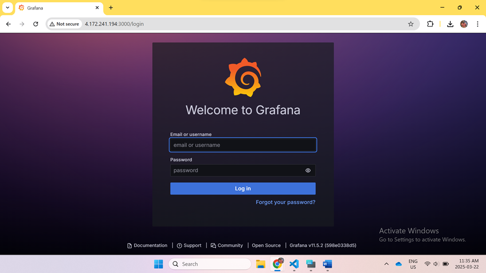
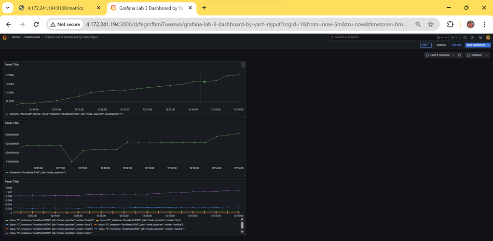

# Grafana & Prometheus Monitoring Setup (Lab 3)

This project demonstrates how to set up Grafana and Prometheus on an Azure VM to monitor system metrics using Node Exporter.

## Files Included

- `prometheus.yml`: Configuration file for Prometheus.
- `commands.md`: Commands used to install and configure Prometheus, Node Exporter, and Grafana.
- `queries.md`: PromQL queries used to create Grafana panels.
- `screenshots/`: Folder containing final output screenshots.

## Procedure Overview

1. **Create and configure Azure VM**
   - Install necessary packages (Prometheus, Node Exporter, Grafana).
   - Configure firewall and security group for port access (3000, 9090, 9100).

2. **Install Prometheus & Node Exporter**
   - Configuration done via `prometheus.yml`.
   - Node Exporter runs on port 9100.

3. **Install and start Grafana**
   - Web interface on port 3000.
   - Login with default credentials and configure Prometheus as data source.

4. **Build Grafana Dashboards**
   - Use queries from `queries.md` to create panels.

5. **Verify setup**
   - Check final working dashboard and login page.

## Final Output

### Grafana Login Page

### Grafana Dashboard Live with Panels
